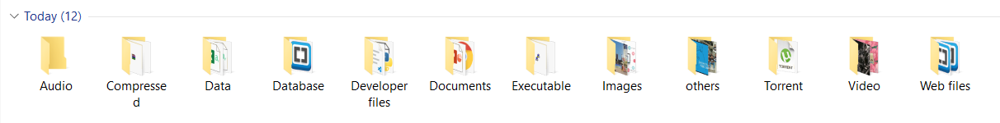

# DownloadsOrganizer
Auto Organize all the files which are not approiately stored. 

## How to Use it 

1. Save the file in folder where you want to organize the files. (script will only access the files which are in that directory Not in subdirectories)
Run the .py file 

2. After that there will be few folder will appear which is shown as below 

3. The .py file also be classified into Developer files --> .py (So you can find in that folder)

The files will be classified into these folders. (You can customize this by changing the source code)
</img>

## Future Changes(Customization) 
* You can make few improvements if you want like creating subfolder in folder to more specification of folders
* You can add your own type of folder and can set up which files will be stored there.

**DO NOT RUN THE FILE** until it is moved to the proper directory because it automatically create few folders in that directory even tho there are no files in folder.
